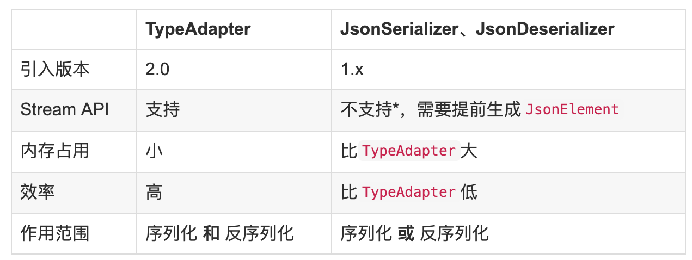

## 1. TypeAdapter
- `TypeAdapter` 是`Gson`自2.0（源码注释上说的是2.1）开始版本提供的一个抽象类，用于接管某种类型的序列化和反序列化过程，
包含两个注要方法 `write(JsonWriter,T)` 和 `read(JsonReader)` 其它的方法都是final方法并最终调用这两个抽象方法。
```java
public abstract class TypeAdapter<T> {
    public abstract void write(JsonWriter out, T value) throws IOException;
    public abstract T read(JsonReader in) throws IOException;
    //其它final 方法就不贴出来了，包括`toJson`、`toJsonTree`、`toJson`和`nullSafe`方法。
}
```

- 注意：`TypeAdapter` 以及 `JsonSerializer` 和 `JsonDeserializer` 都需要与 `GsonBuilder.registerTypeAdapter` 或`GsonBuilder.registerTypeHierarchyAdapter`配合使用
```java
User user = new User("怪盗kidou", 24);
user.emailAddress = "ikidou@example.com";
Gson gson = new GsonBuilder()
        //为User注册TypeAdapter
        .registerTypeAdapter(User.class, new UserTypeAdapter())
        .create();
System.out.println(gson.toJson(user));

// 定义
public class UserTypeAdapter extends TypeAdapter<User> {

    @Override
    public void write(JsonWriter out, User value) throws IOException {
        out.beginObject();
        out.name("name").value(value.name);
        out.name("age").value(value.age);
        out.name("email").value(value.email);
        out.endObject();
    }

    @Override
    public User read(JsonReader in) throws IOException {
        User user = new User();
        in.beginObject();
        while (in.hasNext()) {
            switch (in.nextName()) {
                case "name":
                    user.name = in.nextString();
                    break;
                case "age":
                    user.age = in.nextInt();
                    break;
                case "email":
                case "email_address":
                case "emailAddress":
                    user.email = in.nextString();
                    break;
            }
        }
        in.endObject();
        return user;
    }
}
```

- 当我们为 `User.class` 注册了 `TypeAdapter`之后，只要是操作`User.class` 那些之前介绍的`@SerializedName` 、`FieldNamingStrategy`、`Since、Until、Expose`
通通都黯然失色，失去了效果，只会调用我们实现的`UserTypeAdapter.write(JsonWriter, User)` 方法，我想怎么写就怎么写。
- 测试空串的时候一定是"\"\""而不是""，""代表的是没有json串，"\"\""才代表json里的""。
  
```java
// 注册一个TypeAdapter 把 序列化和反序列化的过程接管
Gson gson = new GsonBuilder()
        .registerTypeAdapter(Integer.class, new TypeAdapter<Integer>() {
            @Override
            public void write(JsonWriter out, Integer value) throws IOException {
                out.value(String.valueOf(value)); 
            }
            @Override
            public Integer read(JsonReader in) throws IOException {
                try {
                    return Integer.parseInt(in.nextString());
                } catch (NumberFormatException e) {
                    return -1;
                }
            }
        })
        .create();
System.out.println(gson.toJson(100)); // 结果："100"
System.out.println(gson.fromJson("\"\"",Integer.class)); // 结果：-1

```

- 这一接管就要管两样好麻烦呀，我明明只想管序列化（或反列化）的过程的，另一个过程我并不关心，难道没有其它更简单的方法么? 当然有！
就是接下来要介绍的 JsonSerializer与JsonDeserializer。

## 2. JsonSerializer与JsonDeserializer
- `JsonSerializer` 和`JsonDeserializer` 不用像`TypeAdapter`一样，必须要实现序列化和反序列化的过程，你可以据需要选择，如只接管序列化的过程就用 `JsonSerializer` ，
只接管反序列化的过程就用 `JsonDeserializer`

```java
Gson gson = new GsonBuilder()
        .registerTypeAdapter(Integer.class, new JsonDeserializer<Integer>() {
            @Override
            public Integer deserialize(JsonElement json, Type typeOfT, JsonDeserializationContext context) throws JsonParseException {
                try {
                    return json.getAsInt();
                } catch (NumberFormatException e) {
                    return -1;
                }
            }
        })
        .create();
System.out.println(gson.toJson(100)); //结果：100
System.out.println(gson.fromJson("\"\"", Integer.class)); //结果-1
```
- 下面是所有数字都转成序列化为字符串的例子
  - `registerTypeAdapter`必须使用包装类型，所以`int.class,long.class,float.class和double.class`是行不通的。
  同时不能使用父类来替上面的子类型，这也是为什么要分别注册而不直接使用`Number.class`的原因。
  - 上面特别说明了registerTypeAdapter不行，那就是有其它方法可行咯?当然！
  换成** `registerTypeHierarchyAdapter`**就可以使用 `Number.class` 而不用一个一个的当独注册啦！
  - registerTypeAdapter与registerTypeHierarchyAdapter的区别：
  
     支持的操作   | registerTypeAdapter | registerTypeHierarchyAdapter
  ------  | ------ | -----
  支持泛型 |   是   |  否
  支持继承 |   否   |  是
       		
       		
  
```java
JsonSerializer<Number> numberJsonSerializer = new JsonSerializer<Number>() {
    @Override
    public JsonElement serialize(Number src, Type typeOfSrc, JsonSerializationContext context) {
        return new JsonPrimitive(String.valueOf(src));
    }
};
Gson gson = new GsonBuilder()
        .registerTypeAdapter(Integer.class, numberJsonSerializer)
        .registerTypeAdapter(Long.class, numberJsonSerializer)
        .registerTypeAdapter(Float.class, numberJsonSerializer)
        .registerTypeAdapter(Double.class, numberJsonSerializer)
        .create();
System.out.println(gson.toJson(100.0f));//结果："100.0"
```

- 如果一个被序列化的对象本身就带有泛型，且注册了相应的`TypeAdapter`，那么必须调用`Gson.toJson(Object,Type)`，明确告诉`Gson`对象的类型。
```java
Type type = new TypeToken<List<User>>() {}.getType();
TypeAdapter typeAdapter = new TypeAdapter<List<User>>() {
   //略
};
Gson gson = new GsonBuilder()
        .registerTypeAdapter(type, typeAdapter)
        .create();
List<User> list = new ArrayList<>();
list.add(new User("a",11));
list.add(new User("b",22));
//注意，多了个type参数
String result = gson.toJson(list, type); 
```

## 3. TypeAdapterFactory
- `TypeAdapterFactory`,见名知意，用于创建`TypeAdapter`的工厂类，
通过对比`Type`，确定有没有对应的`TypeAdapter`，没有就返回`null`，
与`GsonBuilder.registerTypeAdapterFactory`配合使用。

```java
Gson gson = new GsonBuilder()
    .registerTypeAdapterFactory(new TypeAdapterFactory() {
        @Override
        public <T> TypeAdapter<T> create(Gson gson, TypeToken<T> type) {
            return null;
        }
    })
    .create();
```

## 4. @JsonAdapter注解
- `JsonAdapter`相较之前介绍的`SerializedName 、FieldNamingStrategy、Since、Until、Expos`这几个注解都是比较特殊的，
其它的几个都是用在POJO的字段上，而这一个是用在POJO类上的，接收一个参数，且必须是`TypeAdpater，JsonSerializer`或`JsonDeserializer`这三个其中之一。
- 上面说 `JsonSerializer` 和 `JsonDeserializer` 都要配合`GsonBuilder.registerTypeAdapter`使用，但每次使用都要注册也太麻烦了，`JsonAdapter`就是为了解决这个痛点的。
  
```java
@JsonAdapter(UserTypeAdapter.class) //加在类上
public class User {
    public User() {
    }
    public User(String name, int age) {
        this.name = name;
        this.age = age;
    }
    public User(String name, int age, String email) {
        this.name = name;
        this.age = age;
        this.email = email;
    }
    public String name;
    public int age;
    @SerializedName(value = "emailAddress")
    public String email;
}
```

- 使用时不用再使用 `GsonBuilder`去注册`UserTypeAdapter`了。
- 注： `@JsonAdapter` 仅支持 `TypeAdapter`或`TypeAdapterFactory`( 2.7开始已经支持 `JsonSerializer/JsonDeserializer`)

```java
Gson gson = new Gson();
User user = new User("怪盗kidou", 24, "ikidou@example.com");
System.out.println(gson.toJson(user));
//结果：{"name":"怪盗kidou","age":24,"email":"ikidou@example.com"}
//为区别结果，特意把email字段与@SerializedName注解中设置的不一样
```

## 5. TypeAdapter与 JsonSerializer、JsonDeserializer对比
- 

## 6. TypeAdapter实例
- 这里的`TypeAdapter`泛指`TypeAdapter`、`JsonSerializer`和`JsonDeserializer`。
  这里的 `TypeAdapter` 上面讲了一个自动将 字符串形式的数值转换成`int`型时可能出现 空字符串的问题
- 要解决的问题：服务器返回的数据中data字段类型不固定，比如请求成功data是一个List,不成功的时候是String类型，这样前端在使用泛型解析的时候，怎么去处理呢？

```java
Gson gson = new GsonBuilder().registerTypeHierarchyAdapter(List.class, new JsonDeserializer<List<?>>() {
    @Override
    public List<?> deserialize(JsonElement json, Type typeOfT, JsonDeserializationContext context) throws JsonParseException {
        if (json.isJsonArray()){
            //这里要自己负责解析了
            Gson newGson = new Gson();
            return newGson.fromJson(json,typeOfT);
        }else {
            //和接口类型不符，返回空List
            return Collections.EMPTY_LIST;
        }
    }
}).create();
```

```java
Gson gson = new GsonBuilder().registerTypeHierarchyAdapter(List.class, new JsonDeserializer<List<?>>() {
    @Override
    public List<?> deserialize(JsonElement json, Type typeOfT, JsonDeserializationContext context) throws JsonParseException {
        if (json.isJsonArray()) {
            JsonArray array = json.getAsJsonArray();
            Type itemType = ((ParameterizedType) typeOfT).getActualTypeArguments()[0];
            List list = new ArrayList<>();
            for (int i = 0; i < array.size(); i++) {
                JsonElement element = array.get(i);
                Object item = context.deserialize(element, itemType);
                list.add(item);
            }
            return list;
        } else {
            //和接口类型不符，返回空List
            return Collections.EMPTY_LIST;
        }
    }
}).create();
```
- 要注意的点：
    - 必须使用`registerTypeHierarchyAdapter`方法，不然对`List`的子类无效，但如果`POJO`中都是使用`List`，那么可以使用`registerTypeAdapter`。
    - 对于是数组的情况，需要创建一个新的`Gson`，不可以直接使用`context`,不然`gson`又会调我们自定义的`JsonDeserializer`造成递归调用，方案二没有重新创建`Gson`，那么就需要提取出`List<E>`中E的类型，然后分别反序列化适合为E手动注册了`TypeAdaper`的情况。
    - 从效率上推荐方案二，免去重新实例化Gson和注册其它TypeAdapter的过程。
